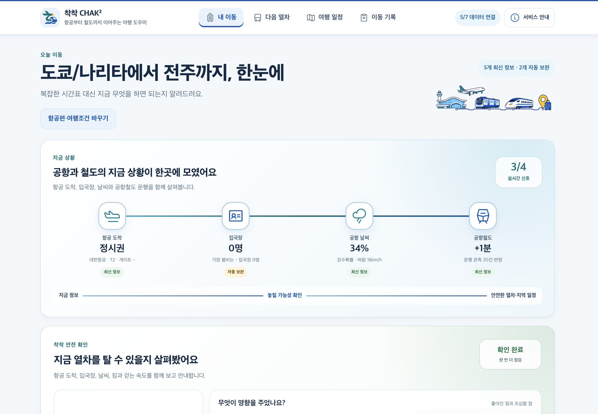
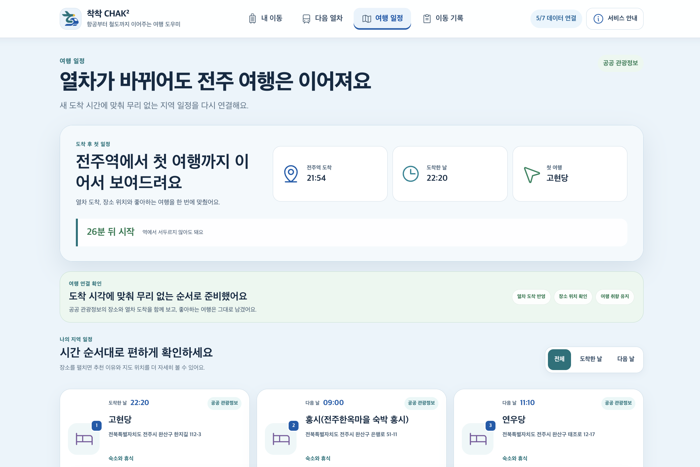
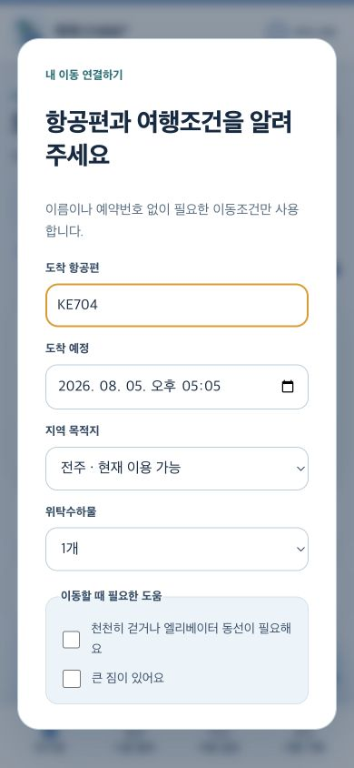
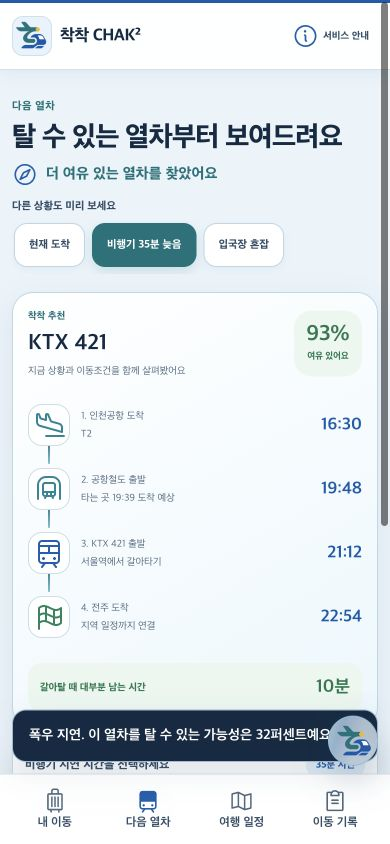
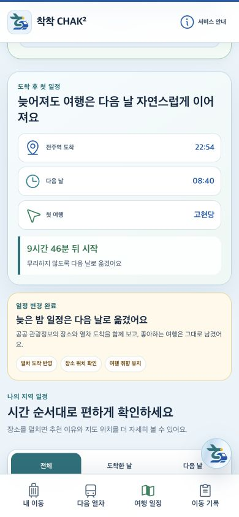
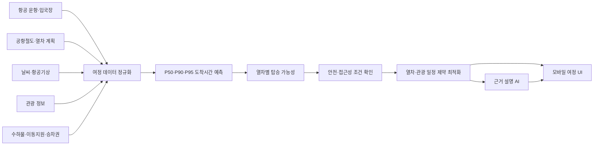

# 착착 CHAK² — 착륙부터 착석까지

이 사본은 상위 프로젝트 루트의 앱 코드를 `npm run sync:portfolio`로 반영합니다. 2026-09-05 개선 결과와 검증 내용은 `docs/improvements-2026-09-05.md`에 기록했습니다. 독립 체크아웃에서는 `npm run check`와 `npm run test:e2e`로 검증합니다.

[](https://github.com/kwakhyun/chakchak-rail-air-ai/actions/workflows/ci.yml)


> 항공편 도착 이후의 입국·수하물·공항철도·KTX·지역 일정을 하나의 흐름으로 연결하고, **가장 빠른 열차가 아니라 실제로 탈 가능성이 높은 여정**을 안내하는 Rail × Air AI 서비스입니다.

[서비스 체험](https://chakchak-rail-air-2026.khyun97.chatgpt.site/) · [3분 발표 화면](https://chakchak-rail-air-2026.khyun97.chatgpt.site/presentation/) · [모델 카드](docs/model-card.md) · [기술 설계](docs/architecture.md)

내일路 해커톤 2026 출품을 계기로 시작했으며, 예선 이후 설계·검증 자료와 공개 범위를 정리해 포트폴리오 프로젝트로 재구성했습니다.

## 해결하려는 문제

항공기가 제시간에 도착해도 입국심사, 수하물 수령, 터미널 이동과 날씨 때문에 실제 승강장 도착시간은 크게 달라집니다. 기존 교통 서비스는 각 구간의 시간표를 따로 보여주기 때문에 사용자가 다음을 직접 판단해야 합니다.

- 예매한 열차를 실제로 탈 수 있는가?
- 놓칠 가능성이 높다면 어느 열차가 더 안전한가?
- 열차가 바뀌면 예약한 관광 일정과 승차권은 어떻게 처리해야 하는가?

착착은 흩어진 데이터를 한 여정으로 계산하고, 변동이 생기면 열차·승차권 처리 순서·지역 일정을 함께 다시 연결합니다.

## 핵심 경험

| 1. 이동 정보 연결 | 2. 탈 수 있는 열차 추천 | 3. 여행 일정 복구 |
|---|---|---|
| 항공 도착, 입국장, 날씨, 공항철도와 개인 이동조건을 한 화면에서 확인합니다. | 공항철도 승강장 도착 범위와 열차별 탑승 가능성을 비교합니다. | 새 도착시각에 맞춰 관광지 운영시간과 예약·체류 조건을 다시 맞춥니다. |





모바일에서는 입력, 다음 열차, 일정 복구와 AI 안내를 하단 메뉴 중심의 짧은 흐름으로 제공합니다.

<p align="center">
  
  
  
</p>

## 무엇이 다른가

### 1. 항공·공항·철도·관광을 하나의 의사결정으로 연결

API 응답을 단순히 나열하지 않고 공통 `Journey Event` 형식으로 정규화합니다. 항공 변경 도착시각, 입국장 혼잡, 날씨와 공항철도 관측은 시간 예측에 사용하고, 관광 정보는 도착 이후 일정의 운영시간·위치·체류 제약에 사용합니다.

### 2. 착착 전용 시간·탑승 예측 모델

직접 구현한 **Monotonic Quantile GBDT**가 공항철도 승강장 도착시간을 P50·P90·P95 세 구간으로 예측합니다. 지연·혼잡·날씨 위험이 커졌는데 예상시간이 오히려 빨라지는 모순을 단조 제약으로 방지합니다. 각 열차에 대해서는 개인 이동조건과 남은 시간을 반영한 탑승 가능성을 별도로 계산합니다.

### 3. 제약조건을 먼저 지키는 여정 최적화

점수가 높더라도 접근성, 예산, 환승 횟수, 예약 가능 여부, 관광지 운영시간을 위반하는 후보는 우선 추천하지 않습니다. 조건을 통과한 후보 중 필수 일정과 지역 체류를 가장 잘 보존하는 여정을 선택하며, 가능한 후보가 없으면 무리한 연결 대신 불가능 사유를 보여줍니다.

### 4. 예매한 승차권을 먼저 보호

KTX와 공항철도 승차권을 운영사별로 나누고 일반·할인·패스·단체표의 반환 위험을 구분합니다. 대체편 좌석을 공식 채널에서 먼저 확인한 뒤 기존 표를 처리하도록 안내하며, 착착이 자동 취소나 자동 재예매를 수행하지 않는다는 경계를 명확히 표시합니다.

### 5. 생성형 AI는 판단이 아니라 설명을 담당

열차 선택과 확률 계산은 자체 모델과 규칙 기반 안전 계층이 확정합니다. OpenAI Responses API는 확정된 숫자와 추천 이유를 쉬운 행동 안내로 바꾸는 데만 사용하며, 키나 네트워크가 없으면 검증된 기본 안내로 전환합니다. 공개 배포에서는 영속적인 호출 제한 장치가 연결된 경우에만 유료 AI 호출을 허용합니다.

## 시스템 구조



핵심 설계 원칙은 **관측값, 예측값, 시연용 값과 실제 운영 결과를 섞지 않는 것**입니다. API가 실패하면 마지막 정상값 또는 시연 스냅샷으로 전환하되 화면에 상태를 표시합니다.

## 데이터 연결

| 영역 | 소스 | 사용 목적 |
|---|---|---|
| 항공 | 인천국제공항공사 운항 현황 | 예정·변경 도착시각, 터미널 |
| 공항 | 인천국제공항공사 입국장 현황 | 입국장 혼잡 신호 |
| 철도 | 공항철도 운행 정보, 코레일 운행계획, TAGO 대체 경로 | 후보 열차와 운행 상태 |
| 날씨 | 항공기상청 METAR, Open-Meteo | 강수·풍속 위험 신호 |
| 관광 | 한국관광공사 TourAPI | 장소, 위치, 이미지와 일정 복구 |

공개 API 키는 모두 서버 환경변수로만 사용합니다. 좌석·운임·발권·환불 가능 여부는 공개 데이터만으로 확정하지 않으며 운영사 공식 채널의 최종 확인 대상으로 남깁니다.

## 모델 검증

같은 800개 고정 시뮬레이션 상황에서 세 가지 예측 모델을 Monte Carlo 참고분포와 함께 비교했습니다.

| 방법 | P50 참고 MAE | P90 참고 MAE | P95 참고 MAE | P90 포함률 |
|---|---:|---:|---:|---:|
| 단순 시간·정규근사 | 9.970분 | 15.298분 | 19.228분 | 80.6% |
| Monte Carlo 참고분포 | 0분 | 0분 | 0분 | 91.3% |
| 기존 단조 보정 | 4.106분 | 4.721분 | **5.191분** | 90.5% |
| 신규 Monotonic Quantile GBDT | **2.880분** | **3.798분** | 5.893분 | **91.6%** |

- 학습 2,400건, 보정 200건, 고정 검증 800건의 합성 여정으로 학습과 비교를 재현합니다.
- 별도 시드의 400개 독립 감사에서 P50 2.875분, P90 3.714분, P95 5.901분의 참고분포 MAE를 기록했습니다.
- 단조성 3,900개 비교, 안전·접근성·제약 최적화 선택, 설명 합계 일치 여부를 검사했습니다.
- 현재 자동 테스트는 모델, 최적화, 공개데이터 장애 처리, 승차권 보호, 개인정보와 HTTP 보안 경계를 포함한 **57개 시나리오**를 통과합니다. 별도로 Chromium에서 데스크톱·모바일 핵심 흐름 2개를 검증합니다.

> 모든 수치는 같은 시뮬레이터가 만든 참고분포에 대한 결과이며 실제 승객 대상 운영 성능이 아닙니다. 원본 비교 결과는 [`evidence/`](evidence/)와 [`docs/model-card.md`](docs/model-card.md)에 공개합니다.

## 로컬에서 실행하기

요구 사항: Node.js 22 이상

```bash
git clone https://github.com/kwakhyun/chakchak-rail-air-ai.git
cd chakchak-rail-air-ai
npm ci
cp .env.example .env.local
npm run dev
```

브라우저에서 <http://127.0.0.1:4173>을 엽니다. API 키가 없어도 시연용 데이터와 기본 안내로 핵심 흐름을 실행할 수 있습니다.

### 선택 환경변수

| 변수 | 용도 |
|---|---|
| `OPENAI_API_KEY` | 결과 설명 AI |
| `OPENAI_MODEL` | Responses API 모델 선택 |
| `ENABLE_PUBLIC_AI` | 공개 배포 유료 AI 허용 여부. 영속 호출 제한 바인딩이 없으면 `true`여도 기본 안내로 전환 |
| `DATA_GO_KR_API_KEY` | 승인된 data.go.kr API 공통 키 |
| `TOUR_API_KEY` | TourAPI 전용 키. 비어 있으면 공통 키 사용 |
| `KORAIL_OPEN_API_ENABLED` | 승인된 코레일 직접 운행계획 사용 여부 |
| `CHAKCHAK_VALIDATION_SECRET` | 익명 검증 토큰 서명 |
| `TRUST_PROXY` | 신뢰할 수 있는 역방향 프록시 뒤에서만 전달 IP 헤더 사용 |

`.env.local`, 운영 기록과 모든 비밀 키는 Git에서 제외됩니다.

## 검증 명령

```bash
npm test                 # 57개 자동 테스트
npm run test:e2e         # Chromium 데스크톱·모바일 핵심 흐름
npm run typecheck        # React/Vinext/Worker TypeScript 엄격 검사
npm run verify           # 필수 파일·문법·전체 테스트 확인
npm run check            # 타입 검사·테스트·Sites 프로덕션 빌드 일괄 확인
npm run train:model      # 고정 시드로 모델 재학습
npm run benchmark:model  # 네 가지 시간 예측 방법 비교
npm run audit:model      # 독립 시드 모델 감사
```

## 기술 스택

- Frontend: Vanilla JavaScript, CSS, PWA, 반응형·접근성 UI
- Runtime: Node.js HTTP server, React/Vite 기반 Sites 배포 어댑터
- AI/ML: JavaScript Monotonic Quantile GBDT, 단조 확률 보정, 시드 기반 Monte Carlo, 제약 최적화
- LLM: OpenAI Responses API의 구조화 출력과 오프라인 폴백
- Quality: Node test runner, Playwright 브라우저 회귀 테스트, 고정 시드 재현 검증, 공개데이터 회로 차단·폴백 테스트

## 프로젝트 구조

```text
public/       서비스·발표 화면과 브랜드 에셋
src/          UI, 자체 모델 추론, 최적화, 승차권 보호
lib/          공개데이터·OpenAI·익명 검증 서버 모듈
scripts/      학습, 벤치마크, 감사와 배포 준비 도구
tests/        모델·API·개인정보 테스트와 Chromium 사용자 흐름 회귀 테스트
docs/         아키텍처, 모델 카드, 검증·운영 설계
evidence/     공개 가능한 모델 비교·독립 감사 결과
server.mjs    로컬 정적 서버와 API
```

## 현재 경계와 다음 단계

현재 구현은 포트폴리오 데모와 시뮬레이션 검증 단계입니다.

- 실제 좌석 조회, 결제, 발권, 자동 취소·재예매를 제공하지 않습니다.
- 실제 승객 이동 결과가 없어 운영 정확도나 환승 성공률을 주장하지 않습니다.
- TAGO 등 일부 공공 API 장애 시 상태를 표시하고 검증된 대체 경로로 전환합니다.
- 다중 인스턴스 운영 전에는 관리형 데이터베이스, HTTPS, 기관 협의와 개인정보 보호 검토가 필요합니다.

다음 단계는 운영기관 데이터로 도착시간과 탑승 결과를 대조하고, 승차권 공식 딥링크와 ITX·일반열차까지 후보 범위를 넓히는 것입니다.

## License

MIT License. 자세한 내용은 [LICENSE](LICENSE)를 확인하세요.
