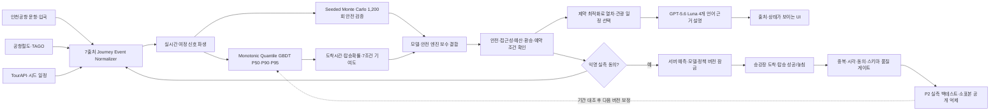
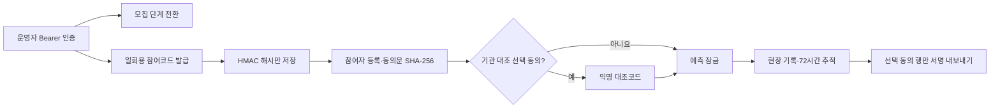

# 착착 기술 설계

## 한 줄 설계

착착은 서로 다른 시계로 움직이는 항공·공항·철도·관광 데이터를 `여정 이벤트`로 정규화한 뒤, 확률적 도착시간을 계산해 “가장 빠른 경로”가 아니라 “실제로 탈 수 있는 경로”를 고릅니다.

## 데이터 흐름

현재 서버에는 인천공항 운항, 입국장 현황, 공항철도, 코레일/TAGO 열차, TourAPI, 항공기상 METAR의 data.go.kr 어댑터와 키 없는 Open-Meteo 예보 어댑터가 구현되어 있습니다. data.go.kr 5종과 Open-Meteo의 실제 응답을 확인했고, TAGO는 승인 상태인데도 인증 전달 오류 코드 `01`을 반환합니다. 철도 시간표는 활용승인 후 한국철도공사 직접 운행계획을 우선 사용하고, TAGO·마지막 정상값·버전 고정 서버 스냅샷 순으로 대체합니다. 현재 스냅샷은 `authoritative: false`인 시연 기준값이며 실제 운행·좌석·운임은 코레일 공식 채널에서 확인합니다. HTTP 성공 여부뿐 아니라 본문 결과 코드도 검사하고 정상 공식 응답만 `live`로 표시합니다.

`src/live-journey.js`는 공식 응답을 화면 장식에 그치지 않고 계산 가능한 여정 신호로 바꿉니다. 운항 예정·변경시각은 항공지연 분으로, 입국장 관측 합계는 혼잡 강도로, Open-Meteo 강수확률·풍속은 날씨 강도로 변환해 연결 엔진에 전달합니다. 공항철도 응답은 운행 관측 상태를 확인하는 근거로 분리하고, TourAPI 장소·주소·이미지는 지역 일정 카드에 사용합니다. 화면은 항공·입국·날씨·공항철도 4개 신호의 실제 연결 수를 `4/4`처럼 표시하며 관광 데이터는 확률 입력으로 오인하지 않게 별도로 표시합니다.

## 착착 자체 모델

`scripts/train_chakchak_model.mjs`는 정상·복합위험·저위험·이동지원 조건을 층화해 학습 2,400개, 확률 보정 200개, 분리 검증 800개를 생성합니다. P50·P90·P95 모델은 분위수 손실을 직접 줄이면서 위험 신호가 커질수록 예상시간이 짧아지는 모순을 단조 제약으로 막습니다. 탑승확률은 P90 기준의 보수적 환승 여유를 별도 보정 세트로 보정합니다. 같은 조건을 1,200회 계산한 Monte Carlo 결과는 학습 정답이 아니라 모델 비교와 범위 이탈 시 안전 전환의 참고분포로 사용합니다. 특성 계약과 품질지표는 `src/chakchak-model-data.js`에 버전 고정 아티팩트로 저장됩니다.

- 입력: 항공지연, 날씨·입국 혼잡, 수하물, 이동지원·큰 짐, 열차까지 남은 시간과 도메인 결합 특성
- 출력: 플랫폼 도착 P50·P90·P95, 후보별 탑승확률·위험등급, 안전조건을 통과한 연결 여정
- 설명: 항공 지연, 입국장, 날씨, 수하물, 이동지원, 터미널·도착 시간대, 열차 여유의 7개 조건이 탑승 가능성을 바꾼 정도를 계산해 `기준 확률 + 변화 합 = 현재 확률`인 워터폴을 생성
- 현재 층화 분리 검증 800개: P50 참고분포 MAE 2.880분, P90 3.798분, P95 5.893분, 탑승확률 MAE 0.0244
- 독립 감사 400개: P50 2.875분, P90 3.714분, P95 5.901분, 탑승확률 MAE 0.0238, 3,900개 단조 비교 위반 0건
- 적용: 안전·접근성 기준으로 적격 후보를 정한 뒤 예산, 환승 횟수, 예약 가능 여부, 관광지 운영시간을 하드 조건으로 확인합니다. 최종 후보는 필수 일정, 예약 일정, 지역 체류시간, 도착시각, 가격, 환승 횟수 순으로 비교합니다. 55%·20%·15%·10% 가중점수는 후보의 안전·도착·대기·접근성을 설명하고 모델과 안전 엔진의 판단을 비교하는 보조 지표이며, 최종 선택을 단독으로 결정하지 않습니다.

검증 지표는 시뮬레이터 참고분포에 대한 모델 근사 성능이며 실제 운영 정확도가 아닙니다. 모델 버전은 `2.0.0-sim`, `realWorldCalibrated: false`로 고정하고 UI의 지표 바로 옆에도 실측 운영 성능이 아님을 표시합니다. 항공지연 0~240분, 날씨·입국 혼잡 0~2단계, 수하물 추가지연 0~90분, 열차 여유 35~360분, 승차 버퍼 0~30분의 확인 범위를 벗어나면 API가 OOD 사유를 반환하고 1,200회 안전 엔진으로 자동 전환합니다.

## P2 익명 실측 검증 경계

P2는 현재 추천을 실시간으로 다시 학습시키지 않는다. 동의 시점의 입력을 서버가 화이트리스트 처리한 뒤 다시 추론하고, 모델·정책 버전과 모든 후보 예측을 잠근다. 현장 결과는 별도 관찰 필드에만 기록하므로 결과 발생 이후 정보가 예측 특성으로 새어 들어가지 않는다.

- 저장 단위: 익명 동의 여정 1건
- 금지 필드: 이름·연락처·주소·예약번호·항공편 번호·IP
- 인증: 난수 여정 ID + HMAC 서명 토큰
- 보관: 30일 자동 만료, 철회 시 해당 여정 물리 삭제
- 실측 지표: 모델/보수결합 Brier·log loss·ECE, P50/P90 MAE, P90 포함률. 현재 P2 파이프라인은 P95를 저장·평가하지 않으며, 현장 검증 전에 P95 필드와 포함률을 별도 추가해야 함
- 공개 게이트: 완료 30건 전 성능 억제, 100건 방향성, 300건과 핵심 구간별 30건 운영 검증 후보
- 해석 경계: 관찰자료는 정확도·보정 검증에는 사용하지만 추천의 인과효과로 해석하지 않음

`runtime/validation/`은 Git에서 제외한다. 토큰 서명키는 로컬에서 0600 권한으로 생성하고 배포에서는 `CHAKCHAK_VALIDATION_SECRET`을 사용한다. 최신 판정은 `npm run audit:real-world`로 재생성한다.

## P2-B 현장 운영 경계

- 파일럿 상태: `READY → ENROLLING ↔ PAUSED → CLOSED`
- 참여 통제: 코드 원문은 한 번만 반환하고 저장소에는 HMAC digest만 보관
- 동의 무결성: 필수·선택 안내문과 동의 버전의 SHA-256을 여정에 고정
- 운영 집계: 사용 가능 코드, 진행·완료, 72시간 기한초과, 기관 대조 동의
- 기관 대조: 직접식별정보와 내부 여정 ID를 제외한 JSON + SHA-256 digest + HMAC-SHA256 서명
- 철회: 여정·익명 대조키·참여자 subject 감사 이벤트를 제거하고 비식별 철회 총계만 유지
- 배포 제한: 현재 단일 프로세스 원자적 파일 방식이며 다중 인스턴스 전 관리형 PostgreSQL 필요

## 판단 규칙

1. 실시간 예정·변경 ETA, 입국 혼잡, 날씨 강도와 여행자의 수하물·이동 조건을 출발점으로 6개 구간의 소요시간 분포를 표본화합니다.
2. 각 표본에서 공항철도와 KTX의 출발시각·최소 환승시간을 통과하는지 검사합니다.
3. 착착 자체 모델이 후보별 탑승확률을 추론하고 Monte Carlo 엔진의 성공 표본 비율과 교차검증합니다.
4. 모델과 엔진이 모두 85%·P90 여유 기준을 통과한 후보만 우선 선택군에 두고, P1-B 정책이 안전·도착·대기·접근성 가중점수를 계산합니다.
5. 모델과 엔진의 단독 선택이 다르면 후보 ID, 가드레일 사유, 최종 종합점수를 API와 쉬운 문장으로 공개합니다. 접근성 위반 후보는 확률이 높아도 제외합니다.
6. 지역 콘텐츠의 운영시간·예약시간·숙소 체크인 제약을 적용해 일정도 함께 이동합니다.

## 데이터 계약 원칙

- `observed`: 기관 API가 제공한 실제 관측값
- `predicted`: 관측값으로 계산한 확률·분위수
- `seed`: API 키 없이 시연하기 위한 명시적 가상값
- `target`: 실증 단계의 목표 KPI

API 응답의 출처 상태는 별도로 `live / demo / fallback` 세 값으로 정규화합니다. 7개 출처마다 소유기관, 데이터명, 핵심 필드, 공식 URL, 확인시각을 반환하고 UI가 그대로 보여줍니다. 같은 항공편·날짜의 융합 결과는 45초 동안 캐시합니다.

화면과 발표자료에서 네 범주를 섞지 않습니다. 특히 코레일 공개 데이터만으로 실시간 좌석 보장이나 재발권이 가능하다고 주장하지 않습니다.

## 실패 안전성

- 공공 API 타임아웃: 시드 시나리오로 전환하고 `fallback` 표시
- data.go.kr 키·활용승인 없음: 공식 응답을 가장하지 않고 `demo` 표시
- 후보 열차 없음: 무리한 환승 대신 숙박/익일 첫차 안내
- 극단 혼잡: 개인 이동 속도와 수하물 조건을 반영해 보수적으로 계산
- 같은 입력 재실행: 시드 난수로 결과 재현
- 개인정보: AI 요청은 이름·연락처·예약번호를 받지 않고, 허용 필드만 길이를 제한해 서버에서 전송
- 실측 검증: 명시적 동의 없이는 저장하지 않고, 중복·미래시각·손상 행은 집계와 공유를 차단하며 철회 시 해당 행 삭제
- AI 장애: 한국어·영어·일본어·중국어 기본 안내로 자동 전환

## AI 설명층과 보안 경계

GPT-5.6 Luna는 OpenAI Responses API를 통해 착착 자체 모델과 안전 엔진이 확정한 확률·열차 번호·시각·관광 조정안을 쉬운 말로 설명합니다. 안전 판단과 경로 선택은 LLM 밖에서 수행하며, 프롬프트에도 열차 식별자·시각 변경, 좌석·승차권·보호 환승 보장을 금지합니다.

- `store: false`로 응답 저장을 요청하지 않음
- 이름 대신 익명 클라이언트 토큰의 SHA-256 파생 식별자만 `safety_identifier`로 사용
- 엄격한 JSON Schema로 제목·요약·2~4개 행동단계·관광조정·주의문만 허용
- 쓰기 요청은 `application/json`만 허용하고 실제 읽은 바이트 기준으로 본문을 32KB로 제한. IP별 분당 10회 제한, 호출 제한 저장소 상한, 입력 필드 화이트리스트와 길이 제한 적용
- 공개 배포는 영속 `PUBLIC_API_RATE_LIMITER` 바인딩이 있을 때만 유료 AI 호출을 활성화하고, 없으면 검증된 기본 안내만 제공
- 공개 HTML 진입 파일은 정적 경로와 분리해 반드시 Worker를 통과시킨다. CSP, HSTS, 클릭재킹 차단, 권한·참조 정보 제한 헤더를 화면과 API 응답에 동일하게 적용
- 키 없음, 타임아웃, 비정상 스키마, 상류 오류 시 동일 형식의 검증된 다국어 폴백

## 서버 API와 배포 범위

공개 Sites 배포판은 체험과 읽기 전용 상태 조회를 제공합니다. 실제 이동 기록을 쓰는 파일럿 API는 공개 배포판에서 `PILOT_NOT_ENROLLING`으로 차단하고, 현재는 로컬 단일 Node 서버에서만 구현을 검증합니다.

### 공개 배포판

- `GET /api/health`: AI 모델·키 설정 여부, 공공데이터 설정과 전체 모드
- `GET /api/data/fusion`: 7개 출처의 정규화 결과, 상태, 확인시각, 공식 URL
- `POST /api/ai/concierge`: 계산 결과를 4개 언어의 구조화 행동 안내로 설명
- `POST /api/ai/guide`: 현재 화면과 승차권 보호 근거 안에서 질문에 답변. 공개 유료 호출은 영속 호출 제한이 있을 때만 활성화
- `POST /api/chakchak/predict`: 자체 모델 버전·지표, 후보별 P50/P90/P95·확률·기여도 워터폴·제약 최적화 결과를 반환
- `GET /api/validation/status`: 실제 완료 표본, 품질 상태, 증거 단계와 공개 가능한 실측 지표
- `GET /api/pilot/status`: 모집 전 `READY` 상태와 참여코드 0건을 반환

### 로컬 검증 서버 전용

- `GET /api/live/arrival`: 기존 시연용 도착편 호환 경로
- `POST /api/validation/enroll`: 명시적 동의 후 서버 재추론·예측 잠금·서명 토큰 발급
- `POST /api/validation/session|observe|withdraw`: 익명 상태 복구·현장 결과·계획 변경·해당 여정 삭제
- `/api/pilot/admin/*`: 참여코드, 운영 단계, 익명 내보내기를 관리하는 운영자 API

## 포트폴리오 고도화 우선순위

1. TAGO 제공기관 인증 전달 오류 신고·복구 확인과 정상 응답 필드 검증
2. 실제 항공편 검색과 7개 출처의 갱신주기·결측·쿼터·장애 관제
3. 코레일톡/공항철도/관광 예약 딥링크
4. 운영기관 협의와 개인정보 보호 절차를 갖춘 뒤 소규모 사용성 검증, 이후 P2 데이터 품질 게이트 적용
5. 기관 게이트·개찰·검표 원장과 익명 대조, 인과평가 설계
6. 교통약자·큰 짐·동반 아동별 분포 보정
7. 운영 대시보드와 모델 드리프트 경보
