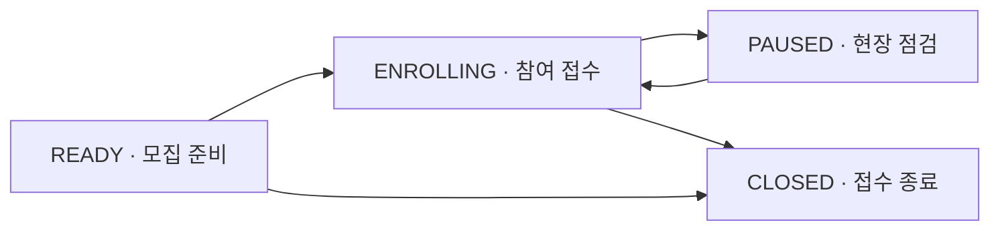
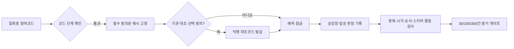

# 착착 P2-B 현장 파일럿 운영 런북

## 현재 판정

**로컬 현장 파일럿 소프트웨어 준비 완료·공개 모집 시작 전.** 2026-08-30 기준 운영 단계는 `READY`, 발급 참여코드 0개, 등록 0건, 완료 0건이다. 공개 Sites 배포판의 등록·관측 API는 차단되어 있다. 실제 성능을 보여 주는 수치가 아니며, 관리형 데이터베이스와 기관 원장 협약 전에는 공개·다중 인스턴스 운영 준비 완료로 표현하지 않는다.

- 파일럿 프로토콜: `chakchak-p2b-field-pilot-v1`
- 코호트: `chakchak-2026-rail-air-pilot`
- 1차 목표: 실제 완료 30건
- 저장 기준시각: UTC, 화면 표시: Asia/Seoul
- 결과 입력 기한: 계획 열차 출발 후 72시간
- 보관기간: 등록 후 최대 30일
- 최신 감사: `output/audit/p2-real-world-validation-readiness.json`

## 운영 목적과 경계

P2-B는 누구나 누를 수 있는 체험 버튼을 실제 성능 표본으로 계산하지 않는다. 운영자가 발급한 일회용 참여코드를 가진 자발적 참여자만 파일럿에 등록하고, 등록 순간 서버가 모델과 정책을 다시 계산해 예측을 잠근다.

기관 대조는 별도 선택 동의를 받은 여정에만 익명 대조코드를 발급한다. 이 코드는 성명·예약번호·항공편 번호가 아니며, 기관 측 확인자료와 연결하기 위한 임시 키다. 현재 구현은 착착 측 익명 내보내기까지만 제공한다. 실제 기관 원장 수신·결합·성과 판정은 코레일·인천국제공항공사와 목적, 기준시각, 보유기간, 책임자를 합의한 뒤 수행해야 한다.

## 역할

| 역할 | 할 수 있는 일 | 볼 수 없는 정보 |
|---|---|---|
| 참여자 | 참여코드 등록, 필수·선택 동의, 현장 결과 기록, 즉시 철회 | 다른 참여자의 기록과 운영자 비밀키 |
| 현장 운영자 | 모집 단계 전환, 참여코드 발급, 집계 상태 확인, 익명 내보내기 | 성명·연락처·주소·예약번호·항공편 번호 |
| 기관 검증 담당 | 별도 협약 후 익명 대조코드 기준 원장 대조 | 동의하지 않은 여정과 착착 토큰 |
| 분석 담당 | 품질 게이트 통과 후 사전등록 지표 계산 | 30건 전 공개 성능과 직접식별정보 |

## 상태 흐름



`CLOSED`에서 다시 접수를 열 수 없다. 새 파일럿을 시작할 때는 코호트와 프로토콜 버전을 새로 발급해야 한다.

## 참여자 데이터 흐름



참여코드 원문은 등록 요청에서만 사용하고 저장소에는 HMAC 해시만 남긴다. 선택 동의가 없으면 익명 대조코드를 만들지 않으며 기관 내보내기에서도 제외한다.

## 현장 운영 절차

### 1. 시작 전 점검

```bash
npm run verify
npm run audit:real-world
npm run pilot:status
```

다음 조건을 확인한다.

- 전체 자동 테스트 통과
- 실제 완료 30건 전 성능 비공개
- 금지 개인정보 필드와 참여코드 원문 0건
- 동의문 무결성 `PASS`
- 결과 기한초과 0건
- 토큰·운영자 비밀키 파일 권한 `0600`

### 2. 참여코드 발급

```bash
npm run pilot:issue -- 10 7
```

예시는 7일 동안 유효한 코드 10개를 만든다. 코드 원문은 명령 실행 시 한 번만 보이며 데이터베이스에는 저장하지 않는다. 코드와 참여자 이름·전화번호·예약정보를 같은 파일에 기록하지 않는다.

### 3. 접수 시작

```bash
npm run pilot:phase -- ENROLLING "현장 운영 시작"
```

참여자는 `실측 검증` 메뉴에서 코드, 필수 동의, 선택형 기관 대조 동의를 확인하고 등록한다.

### 4. 운영 중 감시

```bash
npm run pilot:status
```

운영판에서 사용 가능 코드, 진행 중 여정, 출발 후 72시간이 지난 미완료 결과, 기관 대조 동의 건수를 확인한다. 다음 상황에서는 즉시 `PAUSED`로 바꾼다.

- 동의문 무결성 실패
- 데이터 품질 `BLOCKED`
- 참여코드가 예상보다 빠르게 소진되거나 반복 오입력 발생
- 저장소 쓰기·백업·토큰 복구 실패
- 개인정보가 입력되었다는 신고

```bash
npm run pilot:phase -- PAUSED "품질 또는 보안 점검"
```

### 5. 기관 대조용 익명 자료 생성

```bash
npm run pilot:export
```

파일은 `runtime/validation/exports` 아래에 권한 `0600`으로 생성된다. 다음 항목을 포함한다.

- 익명 대조코드
- 동의 버전과 동의문 해시
- 모델·정책 버전과 잠금 시각
- 선택 열차와 예측 확률·P50/P90
- 현장 승강장 도착·탑승 결과
- 이동지원·복합위험 구간
- SHA-256 digest와 HMAC-SHA256 서명

성명, 연락처, 주소, 예약번호, 항공편 번호, IP, 내부 여정 ID는 포함하지 않는다. 실제 기관 원장이나 대조 결과도 포함하지 않는다.

### 6. 접수 종료

```bash
npm run pilot:phase -- CLOSED "파일럿 모집 종료"
```

종료 후에도 기존 참여자는 보관기간 안에서 현장 결과 기록과 철회를 할 수 있다. 신규 등록과 참여코드 발급은 차단한다.

## 운영 API

### 공개·참여자 API

- `GET /api/pilot/status`: 개인 정보 없는 운영 집계와 준비도
- `GET /api/validation/status`: 공개 가능한 실측 품질·증거 단계
- `POST /api/validation/enroll`: 참여코드·동의 확인 후 서버 예측 잠금
- `POST /api/validation/session`: 서명 토큰으로 익명 여정 복구
- `POST /api/validation/observe`: 승강장·탑승 결과·계획 변경
- `POST /api/validation/withdraw`: 해당 여정·익명 대조키·참여자 감사 흔적 삭제

### 운영자 API

`Authorization: Bearer <CHAKCHAK_PILOT_ADMIN_KEY>`가 필요하다.

- `GET /api/pilot/admin/status`: 최근 운영 감사 이벤트를 포함한 상태
- `POST /api/pilot/admin/invites`: 일회용 참여코드 발급
- `POST /api/pilot/admin/phase`: `READY/ENROLLING/PAUSED/CLOSED` 전환
- `GET /api/pilot/admin/export`: 서명된 기관 대조용 익명 JSON

운영자 키는 브라우저 코드에 넣지 않으며 로컬에서는 `runtime/validation/admin-secret`, 배포에서는 서버 환경변수만 사용한다.

## 품질 지표와 경보

| 항목 | 계산 | 대응 |
|---|---|---|
| 완료율 | 탑승 결과 / 등록 | 낮으면 현장 안내 문구·버튼 동선 점검 |
| 승강장 기록률 | 승강장 도착 / 등록 | P50/P90 시간오차 해석 가능성 판단 |
| 결과 기한초과 | 출발 후 72시간 동안 결과 없음 | 운영판 `ACTION_REQUIRED`, 성능 분모 편향 점검 |
| 동의 무결성 | 저장 해시와 현재 고정 동의문 비교 | 1건이라도 실패 시 `BLOCKED` |
| 기관 대조 가능 | 선택 동의와 익명 코드가 모두 있음 | 이 행만 기관 대조 내보내기에 포함 |
| 실제 성능 공개 | 완료 30건 이상·중대 품질오류 0건 | 그 전에는 Brier·P50/P90 수치 억제 |

파일럿은 관찰연구이므로 완료율·탑승 성공률이 높아도 착착의 인과효과로 해석하지 않는다. 100건에서 시간대·이동지원·복합위험 방향성을 보고, 300건과 각 핵심 구간 30건을 충족해도 기관 대조 후에만 운영 후보로 판정한다.

## 배포 경계와 남은 외부 준비

현재 로컬 검증 저장소는 단일 Node 프로세스가 원자적으로 갱신하는 권한 `0600` 파일이다. 통제된 단일 장비 검증에는 사용할 수 있지만 다음 경우에는 적합하지 않다.

- 서버리스·다중 인스턴스 배포
- 여러 운영자가 동시에 다른 서버에서 접속
- 자동 백업·시점 복구가 필요한 공개 서비스
- 기관 원장 수신과 정기 대조 작업

현재 공개 데모 자체는 HTTPS로 제공되지만 쓰기 API는 열려 있지 않다. 공개 파일럿 전에는 관리형 PostgreSQL, 인증된 HTTPS 쓰기 API, 비밀키 관리, 자동 백업을 연결해야 한다. 이 단계는 신규 외부 계정과 프로젝트 생성이 필요하므로 사용자 승인 후 진행한다.

## 비상 대응

1. `PAUSED`로 신규 등록을 막는다.
2. `npm run pilot:status`와 서버 로그에서 오류 시각을 확인한다. 로그에 참여코드·여정토큰을 복사하지 않는다.
3. 개인정보 신고가 있으면 해당 참여자가 화면의 철회 기능으로 즉시 삭제하도록 안내한다.
4. 데이터 손상 시 성능 공개를 중단하고 감사 결과를 `NEEDS_REVISION`으로 유지한다.
5. 원인·영향 범위·조치 시각을 개인식별정보 없이 운영 기록에 남긴다.

## 자동 검증

P2-B 자동 테스트 6개는 다음을 보장한다.

1. 모집 단계·참여코드 없는 등록 차단과 코드 재사용 거부
2. 참여코드 원문 비저장·동의문 해시·선택 동의 고정
3. 코드·진행·기한초과·기관대조 운영 집계
4. 선택 동의 행만 내보내기 및 서명 위변조 탐지
5. 철회 시 여정·대조키·참여자 감사 흔적 물리 삭제
6. 준비→접수→중지→재개→종료 상태 전환 제한

전체 제품 테스트는 51개다. 실제 완료 표본은 현재 0건이다.
