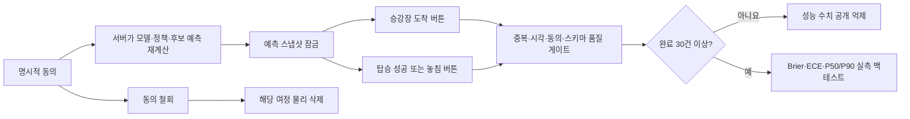

# 착착 P2 익명 실측 검증 프로토콜

## 현재 판정

**수집 파이프라인 준비 완료·실측 성능 주장 차단.** 2026-08-04 기준 실제 완료 여정은 0건이다. 따라서 모델 카드의 시뮬레이션 지표를 실제 운영 정확도로 해석하지 않으며 Brier, P50/P90 실측 오차, 탑승 성공률을 공개하지 않는다.

재현 가능한 최신 판정은 다음 명령과 산출물에서 확인한다.

```bash
npm run audit:real-world
```

- 감사 산출물: `output/audit/p2-real-world-validation-readiness.json`
- 실제 저장소: `runtime/validation/journeys.json` — Git 제외, 0600 권한
- 데이터 단위: 명시적으로 동의한 익명 여정 1건
- 저장 시각: UTC, UI 표시: Asia/Seoul
- 보관 기간: 등록 후 최대 30일

## 질문과 판정 범위

P2는 다음 질문에 답한다.

1. 착착이 잠근 탑승확률과 실제 탑승 성공·실패가 얼마나 일치하는가?
2. 플랫폼 도착 P50/P90과 사용자가 기록한 실제 승강장 도착시각의 오차는 얼마인가?
3. 보통 이동, 이동지원, 복합위험 구간에서 데이터와 오차가 충분히 대표되는가?
4. 모델 단독 확률과 모델·안전 엔진의 보수 결합 중 어느 쪽이 실제 확률 보정에 더 적합한가?

관찰자료만으로 `착착 때문에 탑승 성공률이 높아졌다`는 인과효과에는 답하지 않는다. 인과효과에는 기관 대조군, 무작위 또는 준실험 설계가 추가로 필요하다.

## 수집 흐름



브라우저가 성능값을 직접 제출하지 않는다. 등록 API는 허용된 비식별 입력만 받은 뒤 서버에서 `predictChakchakJourney`를 다시 실행하고 그 결과를 저장한다. 이후 난수 여정 ID와 HMAC 서명 토큰이 있어야 현장 결과 기록·계획 변경·삭제가 가능하다.

## 개인정보 최소화

| 저장 | 저장 금지 |
|---|---|
| 난수 여정 ID, 동의 버전·시각 | 성명, 성별, 생년월일 |
| 모델·정책 버전, 비식별 이동조건 | 휴대전화, 이메일, 주소 |
| 후보별 예측, 선택한 열차 ID | 예약번호, 항공편 번호 |
| 승강장 도착시각, 탑승 성공·놓침 | IP 주소, 위치 이동궤적 |

서버는 남용 방지를 위해 IP별 인메모리 속도 제한을 적용하지만 IP를 실측 저장소에 쓰지 않는다. 철회 API가 성공하면 해당 난수 ID의 예측과 관측 행을 저장소에서 제거한다. 로컬 토큰 서명키는 `runtime/validation/token-secret`에 0600으로 자동 생성하며 배포 환경에서는 `CHAKCHAK_VALIDATION_SECRET`을 사용한다.

## 포함·제외 규칙

포함 조건:

- 동의 버전 `2026-08-04`에 명시적으로 동의
- 서버가 잠근 모델·정책·후보 스냅샷 존재
- 고유 여정 ID
- 허용된 ISO 시각과 `BOARDED` 또는 `MISSED` 결과

성능 분모 제외 및 공유 차단 조건:

- 중복 여정 ID
- 동의 누락·버전 불일치
- 서버 현재시각보다 미래인 현장 기록
- 예측 후보에 없는 계획 열차
- 등록 이전의 현장 기록
- 알 수 없는 탑승 결과 또는 손상된 스키마

철회·30일 만료 행은 저장소에서 제거되므로 분석 모집단에도 남지 않는다.

## 사전등록 지표

| 지표 | 계산 | 분모 |
|---|---|---|
| 실제 탑승 성공률 | `BOARDED / (BOARDED + MISSED)` | 유효 탑승 결과 여정 |
| 모델 Brier | `(모델확률 - 실제 0/1)²` 평균 | 유효 탑승 결과 여정 |
| 보수 결합 Brier | `(결합확률 - 실제 0/1)²` 평균 | 유효 탑승 결과 여정 |
| Log loss | 실제 이진 결과의 음의 로그우도 평균 | 유효 탑승 결과 여정 |
| ECE | 5개 확률 구간의 예측–관측 차이 가중평균 | 유효 탑승 결과 여정 |
| P50/P90 MAE | 예측 도착분과 실제 도착분의 절대오차 평균 | 승강장 도착 기록 여정 |
| P90 포함률 | `실제 도착분 ≤ 예측 P90` 비율 | 승강장 도착 기록 여정 |
| 정책 준수율 | 실제 계획 열차가 P1-B 최종 후보와 같은 비율 | 유효 탑승 결과 여정 |

평균의 평균을 사용하지 않고 원시 여정 분자·분모에서 다시 계산한다. 모델 버전, 시간대, 보통 이동·이동지원, 복합위험 구간을 별도 집계하며 비교 구간의 표본 수를 함께 표시한다.

## 증거 단계와 공개 게이트

| 단계 | 완료 여정 | 공유 원칙 |
|---|---:|---|
| 수집 중 | 0–29 | 성능 수치 비공개 |
| 파일럿 근거 | 30–99 | 주의문과 내부 공유만 |
| 방향성 근거 | 100–299 | 한계·구간별 표본과 함께 공유 |
| 운영 검증 후보 | 300 이상 | 보통 이동·이동지원·복합위험 각 30건 이상 및 중대 품질 오류 0건 필요. 기관 대조 후 확정 |

30·100·300건은 제품 검증의 사전등록 운영 게이트이며 통계적 유의성을 자동 보장하지 않는다. 실제 기저 탑승률과 허용오차를 확인한 뒤 검정력 분석으로 재산정한다.

## 품질·편향 검사

- 완전성: 등록 대비 승강장·탑승 결과 완결률
- 유일성: 여정 ID와 이벤트 멱등성
- 유효성: 시각, 결과 enum, 후보 열차, 동의 버전
- 시의성: 이벤트 발생–수집 지연, 30일 만료
- 대표성: 보통 이동·이동지원·복합위험 완료 표본
- 버전 드리프트: 모델·정책 버전별 분리
- 누출 방지: 결과 발생 이후 필드를 예측 스냅샷에 포함하지 않음

자기기록은 앱을 끝까지 사용한 사람을 과대대표할 수 있다. 따라서 완료율 자체를 품질지표로 공개하고, 기관 데이터 대조 시 미응답자와 실패 여정이 누락되지 않았는지 확인한다.

## 구현 API

- `GET /api/validation/status`: 공개 가능한 집계·품질·증거 단계만 반환
- `POST /api/validation/enroll`: 동의 확인 후 서버 재추론·예측 잠금·서명 토큰 발급
- `POST /api/validation/session`: 토큰으로 현재 익명 여정 상태 복구
- `POST /api/validation/observe`: 승강장 도착, 탑승 성공·놓침, 계획 열차 변경
- `POST /api/validation/withdraw`: 해당 여정 전체 물리 삭제

## 검증 상태

P2 자동 테스트 7개가 다음을 보장한다.

1. 완료 30건 전 성능 억제
2. Brier·P50/P90 계산 독립 재산출
3. 중복·미래시각 행 차단
4. 동의·토큰·멱등 기록·상충 결과 거부·철회 삭제
5. 실제 이동시각보다 이른 결과 입력 거부
6. 확률 범위·P50/P90·현장 관측 순서 모순 차단
7. 30일 경과 여정의 조회 시점 물리 삭제

P2-B 현장 운영 테스트 6개는 일회용 참여코드·모집 단계·동의문 해시·운영 기한초과·선택 동의 내보내기·위변조 탐지·철회 삭제·상태 전환을 검증한다. 전체 제품 테스트는 43개다. `calculationSelfCheck`의 40건은 계산식 정답만 확인하는 합성 고정자료이며 실제 운영 성능에 포함하지 않는다. 현장 운영 절차는 `docs/field-pilot-operations.md`를 따른다.

## 다음 실증 순서

1. 본선 참가자·멘토에게 실측 화면과 철회 절차를 설명하고 자발적 동의를 받는다.
2. 30건에서 스키마·현장 버튼·완결률·계산 오류만 확인하며 모델 성능 결론을 내리지 않는다.
3. 100건에서 시간대·이동지원·복합위험 구간을 분리해 방향성을 검토한다.
4. 코레일·인천공항공사와 개찰·게이트·검표 중 탑승 성공 기준시각을 합의한다.
5. 기관 대조가 가능한 시점에 사전등록 분석계획과 검정력 분석을 고정한 뒤 정책 가중치 재보정을 검토한다.
